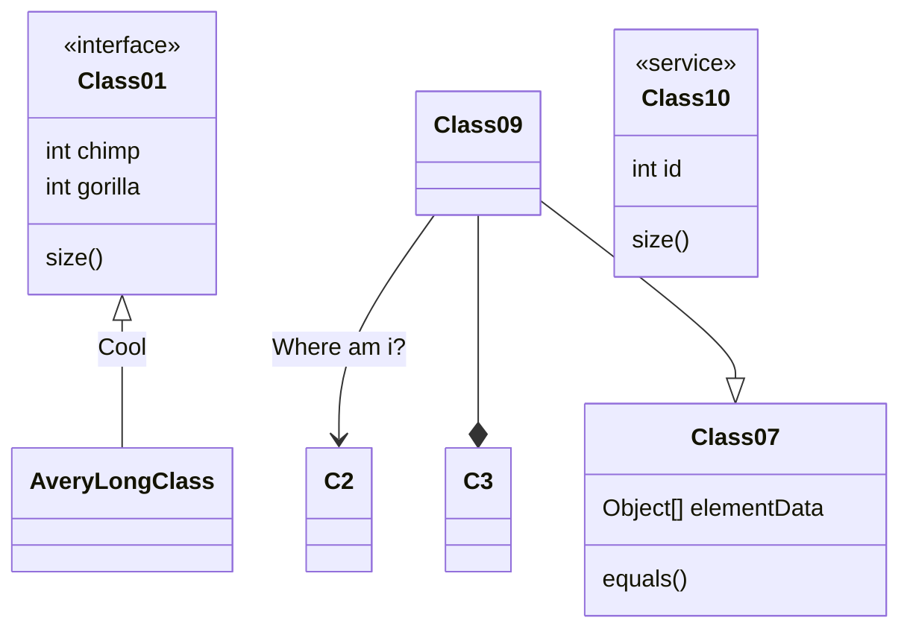

<a id="readme" style="visibility:hidden">&nbsp;</a>

<br>

<p align="center">
  <a class="logo" href="https://github.com/qinhua/halo-theme-joe2.0">
    
  </a>
</p>

<p align="center">Joe 主题 Halo 移植版</p>

<p class="badge-row" align="center">
  <a href="https://halo.run" target="_blank">
    
  </a>
  <a href="https://github.com/qinhua/halo-theme-joe2.0" target="_blank">
    
  </a>
  <a href="https://github.com/qinhua/halo-theme-joe2.0" target="_blank">
    
  </a>
  <a href="https://halo.run" target="_blank">
    
  </a>
</p>

> `Joe2.0` 是 [Typecho Themes Joe](https://github.com/HaoOuBa/Joe) 主题的 Halo 版，由于 [社区](https://bbs.halo.run/) 之前有兄弟移植过，这次就叫 Joe2.0 吧，此次在原版主题上做了不少修改和适配，由原版的 php 模板调整为 freemarker， 移除了平台无关的特性，同时增加了一些平台特定的配置，保持灵活性的同时最大限度的移植了原版功能，希望大家喜欢 ❤️ <br>
> 🌸 同时也要在此感谢原作者 [Joe](https://github.com/HaoOuBa)，欢迎大家加入 [Joe2.0 交流群：850501175](https://qm.qq.com/cgi-bin/qm/qr?k=JJ3FVO1i_plWJohono16N5z7XI_dqEpK&jump_from=webapi)

<br>

#### 👀 [预览主题](https://bbchin.com)

📗 [使用文档](https://qinhua.github.io/halo-theme-joe2.0)

<br>

**效果图** 👇


<!-- 
 -->

<br>

### 🌈 安装 & 更新

> 安装前请确保 `Halo版本` 和主题的兼容性，`V1.0.10` 及以上版本仅支持 `Halo 1.5+`，以下版本兼容到 `Halo 1.4.11`，请知悉。

1. 复制主题仓库地址 `https://github.com/qinhua/halo-theme-joe2.0.git`

2. 进入博客后台管理 `外观-主题-安装-远程下载`，贴入仓库地址进行安装（建议直接使用最新版本 ）。
   如果在线安装失败（大概率失败 😆 ），那就选择 `本地上传`，到主题 [Release](https://github.com/qinhua/halo-theme-joe2.0/releases) 页面下载指定版本主题压缩包，并上传上去（**务必在 `Release` 页面下载压缩包，否则可能出现资源加载出错的问题**）；

3. 等待提示安装完成即可；

4. 更新主题时，建议直接通过 `外观-主题-Joe2.0-更多-从主题包更新` 把下载好的 `zip` 包上传上去，然后 **先切换到其他主题，再切回本主题，并进入主题设置执行一次保存，最后强刷前端页面即可**（这里切主题主要是为了避免有时候主题状态未激活和缓存的问题）。

> 如果 `github` 访问不了，可以访问 `gitee` 仓库：https://gitee.com/duider/halo-theme-joe2.0

#### ⚠️ 必读

1. 安装主题后请务必到 `后台管理 - 博客设置 - 高级选项` 中开启 `API服务` 并配置 `Access key` 为 `joe2.0`（切记要和主题设置中的 `AccessKey` 一致），不然部分用到 `Content API` 的页面会请求失败并报错。（请参考以下报错）

```text
“API has been disabled by blogger currently” —— 后台管理中未开启API服务
“API access key is mismatch” —— 主题中的 AccessKey 和后台管理中的不一致
```


2. 如果后台管理中之前已经配置了其它的 `Access Key`（内容不是 `joe2.0`），那么需要你到本主题设置中的 `基本设置-AccessKey<必填>` 同步一下这个 `Access key`，保证两部一致即可（**切记一致才行，且不要填写中文或特殊字符**）。

3. 有时，主题升级后配置项变化较大，直接访问博客可能会报错，导致页面渲染不出来。此时，只需要进入当前主题的设置界面执行一下保存操作来更新旧的配置，然后再访问页面即可；

4. 有时，明明已经提示主题更新成功了，但访问博客时页面还是加载的旧版本的文件，可能是由于 `主题激活状态不正常` 或 `主题缓存的问题` 导致的。此时，只需要先启用其他主题再启用本主题即可，建议每次更新主题之后都做一下这个操作（目前后台管理系统还不太完善）。**还有就是如果你配置了 CDN 服务，记得清理相应节点的缓存，让它回源取最新资源。**

5. **强烈建议** 每次更新主题后，**务必先清空一下浏览器缓存**，保证加载的资源都是最新版本的，**并到主题设置中执行一次保存**，保证配置项是最新的，不然可能有各种报错（你可以通过 `Ctrl + F5` 强制刷新或者 `Ctrl + Shift + DEL` 清空浏览器所有缓存）。

6. 最后，建议大家在 `后台管理-系统-博客设置-高级选项-其他设置` 中开启 `全局绝对路径`。

<br>

### 🔧 主题配置

> 此次修改对外暴露了大量的设置项，主要是为了最大程度方便用户对博客进行配置，详细设置项请参见主题根目录下的 `settings.yaml` 文件。


<br>

### ⭐️ 主题功能

> 此次在功能上做了大量移植，在尽量不破坏原主题风格的情况下，加入了 `halo` 主题常见的配置项，也融入了一些自己的改进 🤔。
> 具体功能请在 `后台 -> 外观 -> 主题 -> 设置` 中进行配置，配置项已按不同场景分类，便于快速查找。

- [x] 浅色/暗黑模式
- [x] 三级导航
- [x] 轮播图 <可配置数据源>
- [x] 精品分类 <可配置数据源>
- [x] 自定义主题色
- [x] 自定义字体
- [x] 自定义背景图
- [x] 自定义社交渠道
- [x] 归档页定制<按年/月统计>
- [x] 日志页面定制
- [x] 文章分享
- [x] Toc 目录 <可通过文章设置单独控制>
- [x] 代码高亮 + 行号 + 复制 + 折叠
- [x] 文章和日志页 点赞 + 评论
- [x] 文章页 a 标签新页面打开
- [x] 文章页复制加版权文字
- [x] 文章内容评论后可见
- [x] 播放器插件/B 站视频
- [x] PDF 插件
- [x] 留言页面
- [x] 网易歌单
- [x] 博主可选头像框
- [x] 博主等级展示
- [x] 全局预载图自定义
- [x] 缺省图片配置
- [x] 每日一句
- [x] 百度收录查询 + 主动推送
- [x] 页面加载条
- [x] 离屏提醒
- [x] 网站公告
- [x] 二维码模块
- [x] 3D 标签云
- [x] 看板娘
- [x] 图库页面定制
- [x] 自定义邮件模板
- [x] 空白页模板
- [x] 社交账号配置
- [x] 二维码打赏
- [x] 广告配置 <侧边栏 + 文章页>
- [x] 页面元数据控制
- [x] 自定义 JS/CSS
- [x] 自定义 favicon <支持视频、动图>
- [x] 站点运行时间
- [x] 绿色模式 <备案模式>
- [x] 灰色模式 <RIP 模式>

<br>

### ✨ 改进点

- meta 标签优化
- ftl 模板格式化
- 导航栏优化
- 页脚调整
- 评论组件定制
- SEO 优化
- 样式优化
  - 使用 Less
  - 根据主题模式调整了部分配色
  - 优化 z-index 属性
  - 滚动优化
- 代码优化
- 代码风格
  - Eslint + Stylelint
- JS 和 CSS 兼容性处理
  - JS 使用 Babel 转换
  - CSS 引入 autoprefixer
- 页面性能优化
  - 按需引入
  - 图片懒加载
  - DNS 预解析
  - Gzip
- 加载状态优化
  - 加载条
  - 预载图
  - 错误图
  - 空白状态
- 404 页面
- 去除无用配置
- 项目目录调整
  - 简化目录
- 部分缺陷修复
- 解析主题配置项

<br>

### 📃 TODO

> 目前仍有部分功能不完善，暂时没时间做或受限，后面继续迭代。

- 欢迎页面
- 统计页面
- 集成统计插件
- 视频背景
- 相册页优化
- 升级评论组件（头像保存等）
- 自定义模板引擎
- 字号调整
- Pjax
- ~~博客备份~~

<br>

### 📈 项目状态


<br>

### 📚 开发指南

> 1、推荐使用 **VSCode** 开发，首先安装 **EasyLess** 插件来转换并压缩 `less` 文件，保存时会自动生成 `*.min.css` 文件，配置如下：

```js
"less.compile": {
    "out": "./min/",
    "outExt": ".min.css",
    "compress": true,
    "sourceMap": false,
    "autoprefixer": "> 2%, last 2 versions, not ie 6-9"
  }
```

> 2、安装 **JS & CSS Minifier** 插件来转换并压缩 js 文件，保存时会自动生成 `*.min.js` 文件，配置如下：

```js
  "es6-css-minify.js": {
    "mangle": false,
    "compress": {
      "unused": true
    },
    "output": {
      "quote_style": 0
    },
    "warnings": true
  },
  // 保存时自动生成，no 为手动，可点击编辑器底部 Minify 按钮生成
  "es6-css-minify.minifyOnSave": "yes",
  "es6-css-minify.jsMinPath": "/source/js/min"
```

> 3、转换并压缩 `ES6+` 代码（前 2 步里的 js 没有经过 babel 编译，只可用于开发环境）：

- 安装 `nodejs`；
- 主题目录下执行 `npm i` 安装依赖；
- 执行 `npm run build` 即可在相应目录生成可用于生产环境的 js 和 css 文件。

<br>

### 🔍 代码规范

项目默认配置了 `husky` 和 `lint-staged`，在 `commit` 阶段通过 `eslint` 和 `stylelint` 对代码进行自动格式化，然后打包，保证最终提交代码的规范性。

<br>

### 🤔 常见问题

> 主要是一些开发及使用过程中暴露出来的问题，在这里统一列出来方便大家查阅。

#### 1、如何获取当前主题的配置信息？

可以通过 `window.ThemeConfig` 直接获取。

#### 2、如何自定义导航条菜单图标？

> 主题自身已经引入了部分 `iconfont` 图标，你可以直接用（[全在这里](https://bbchin.com/iconfont-joe2.0/)），如果想在这个基础上增加图标，可联系我加入该项目的图标组，加入后即可获取最新的字体链接进行替换（template/module/link.ftl 中第 25 行）。`iconfont` 使用方式如下：<br> > **（目前主题菜单只支持字体图标，若要用图片请自行修改代码）**

```html
<i class="joe-font joe-icon-xxx"></i>
```


**如果你要用自己的图标，请往下看：**

- 首先通过 [iconfont](https://www.iconfont.cn/) 获取自己的图标链接，也可以用 [fontawesome](http://www.fontawesome.com.cn/) 的字体，注意要使用 `font-class` 类型，最后得到这种地址：`//at.alicdn.com/t/font_2788564_1f1rnuqwnzj.css`

- 通过 `管理后台-外观-主题-Joe2.0-设置-自定义`，将图标地址贴入 `字体图标链接` 中并保存；

- 通过 `管理后台-外观-菜单`，为相关菜单添加图标，也就是字体图标的类名，类似如下这种（字体名称 + 图标名称，具体以你生成时的字体名为准），记得保存；

  ```text
  iconfont icon-home
  ```

- 最后，重新进入你的博客即可看到效果。

#### 3、如何配置多级菜单？

> Halo 后台目前支持配置 3 级及以上的菜单，当前主题已支持最多 3 级菜单。你需要到 `管理后台-外观-菜单` 中先建好要用的菜单，然后使用鼠标拖拽相应菜单，调整到你想要的顺序和结构（**上下拖动**是排序，**左右拖动**是改变层级，多尝试几次，不太灵敏）。


#### 4、如果一个菜单有子菜单，如何禁止父菜单跳转？

- 通过 `管理后台-外观-菜单`，设置相关菜单的地址为 `#`，保存即可，子菜单同理；

- 最后，重新进入你的博客即可看到效果。

**tips: 为了适配和展示效果，不建议添加过多菜单。目前最多可展示 3 级。**

#### 5、子菜单如何设置新页面打开？

通过 `管理后台-外观-菜单`，设置菜单的打开方式为 `新页面`，保存即可。

#### 6、如何隐藏单个菜单？

有时你可能想临时隐藏某个菜单，但是不想删除（目前后台管理中并没提供隐藏功能）。

此时你可以通过 `管理后台-外观-菜单`，在相关菜单的标题前面添加 `#hide` 标志，然后保存即可（给父菜单添加后，子菜单也会隐藏）。


#### 7、如何配置邮件服务？

Halo 已经提供好了邮件服务，我们只需要配置相关参数即可。请参见 [《Halo 博客配置邮件通知服务》](https://www.yuque.com/docs/share/ccd93bac-6265-44a1-b2ec-c1e8fc101cdb)

#### 8、如何添加留言页/空白页？

> 主题中的留言页面是自定义页面，所以需要你进入 `后台管理-页面` ，点击 `新建页面` 添加留言页，记得填写 `页面标题、别名`，并选择自定义模板 `leaving` 进行发布。最后进入 `外观-菜单` 添加刚才自定义的留言页，保存后刷新前台页面即可，其它自定义页面同理。

目前支持的 `自定义模板` 有 3 种：

- `empty`：完全空白不带任何资源的空页面，适合独立开发一个新页面的场景。
- `only_header_footer`：仅包含导航条和页脚的空页面，适合在当前博客基础上进行开发的场景。
- `leaving`：当前主题内已定制的 `留言页` 模板，可直接使用。


#### 9、如何配置自定义轮播图数据？

> 目前主题中的轮播图支持 7 种数据来源，默认的手动模式需要我们自己配置数据，为了减少表单数量提高灵活性，使用了约定格式的方式来配置，具体规则如下：

- 多个轮播图之间用 `=====` 隔开
- 属性之间用 `-|||-` 隔开
- 为了美观，允许换行
- 不需要跳转写 `#` 即可

🐧 请严格按照此格式或默认示例进行配置，否则可能导致网站崩溃，以下为示例，可复制到表单中编辑（**首页精品分类** 同理）：

```text
轮播1标题
-|||-
轮播1副标题
-|||-
轮播1图片链接
-|||-
轮播1跳转链接
=====
轮播2标题
-|||-
轮播2副标题
-|||-
轮播2图片链接
-|||-
#
```

#### 10、修改主题中的 CSS 或 JS 后页面为什么还是引入的旧文件？

> 目前主题静态资源默认从源站加载，也可以配置 `CDN`。

- 请先确认 **是否是浏览器缓存** 导致的，清除下缓存试试；
- 检查 **修改的文件是否是实际加载的文件**，生产环境的 js 文件对应 `source/js/min` 目录，css 文件对应 `source/css/min` 目录
- 检查是否在主题设置中配置了 `自定义CDN域名`，如果配置了，**可能是由于 CDN 节点缓存导致的**，可以选择自行刷新目录缓存，让它回源取最新资源，或者关闭 CDN 直接从源站获取静态资源。

```html
<link
  rel="preload stylesheet"
  as="style"
  href="${BASE_RES_URL}/source/css/min/index.min.css?v=${theme.version!}"
/>
```

其中 `${BASE_RES_URL}` 为静态资源域名，默认为 `${theme_base!}`，即主题目录，如果配置了 CDN，那就是 `CDN 域名 + theme_base`。

#### 11、如何通过元数据为页面进行单独的功能配置？

> 这里以文章详情页为例进行说明。

- 很多时候，我们希望能够单独控制文章详情页的功能，如分享、打赏、复制、点赞、评论、目录等。主题目前已经为文章详情页暴露了常用的元数据配置，具体大家可以查看 `theme.yaml` 文件中的 `postMetaField` 字段。（自定义页面对应字段 `sheetMetaField`）

- 如果想通过元数据来单独控制页面功能，可以到 `后台管理-文章-所有文章` 中找到要修改的文章，然后点击设置，再点击底部保存按钮旁的 `高级`，即可在弹框中对元数据进行配置，字段格式和主题配置是一致的，布尔值填 `true` 或 `false`，都是字符串形式。


> 🍢 具体元数据请参考下面的表格。

##### a、文章页元数据（postMetaField）

| 字段名                | 值类型  |   默认值   | 描述                                                   |
| :-------------------- | :-----: | :--------: | :----------------------------------------------------- |
| enable_aside          | Boolean |    true    | 是否启用侧边栏                                         |
| enable_page_meta      | Boolean |    true    | 是否展示页面元信息（即顶部的字数、阅读量等数据）       |
| enable_passage_tips   | Boolean |    true    | 是否展示温馨提示                                       |
| enable_collect_check  | Boolean |    true    | 是否启用百度收录检查                                   |
| enable_read_limit     | Boolean |   false    | 是否开启评论后可见                                     |
| use_raw_content       | Boolean |   false    | 是否渲染原始内容                                       |
| enable_comment        | Boolean |    true    | 是否启用评论功能                                       |
| enable_toc            | Boolean |    true    | 是否启用 Toc 目录                                      |
| toc_depth             | Number  |     0      | Toc 目录默认展开层级 0~6，对应标题层级 h1 ～ h6        |
| img_align             | String  |  "center"  | 图片对齐方式（left-左对齐；center-居中；right-右对齐） |
| img_max_width         | String  |   "100%"   | 图片最大宽度                                           |
| enable_copy           | Boolean |    true    | 是否允许复制内容                                       |
| enable_donate         | Boolean |    true    | 是否启用打赏（必须配置好相应二维码）                   |
| enable_share          | Boolean |    true    | 是否启用分享                                           |
| enable_like           | Boolean |    true    | 是否启用点赞                                           |
| code_theme            | String  | “one-dark” | 指定代码主题（默认和全局设置一致）                     |
| enable_fold_long_code | Boolean |    true    | 是否开启长代码块自动折叠                               |
| enable_katex          | Boolean |   false    | 是否启用公式支持                                       |

##### b、自定义页元数据（sheetMetaField）

| 字段名               | 值类型  |  默认值  | 描述                                                   |
| :------------------- | :-----: | :------: | :----------------------------------------------------- |
| enable_aside         | Boolean |   true   | 是否启用侧边栏                                         |
| enable_page_meta     | Boolean |   true   | 是否展示页面元信息（即顶部的字数、阅读量等数据）       |
| enable_collect_check | Boolean |   true   | 是否启用百度收录检查                                   |
| use_raw_content      | Boolean |  false   | 是否渲染原始内容                                       |
| enable_comment       | Boolean |   true   | 是否启用评论功能                                       |
| img_align            | String  | "center" | 图片对齐方式（left-左对齐；center-居中；right-右对齐） |
| img_max_width        | String  |  "100%"  | 图片最大宽度                                           |
| enable_katex         | Boolean |  false   | 是否启用公式支持                                       |

#### 12、如何支持数学公式和 Mermaid 图形？

> 主题已经提供了对 `数学公式` 和 `Mermaid图形` 的支持，数学公式使用 `Katex` 进行渲染，默认为关闭状态，需要手动打开。

- 必须先在 `后台管理-外观-主题设置-文章页` 中启用 `数学公式支持`

```text
$\sum_{i=0}^N\int_{a}^{b}g(t,i)\text{d}t$
$$\Gamma(z) = \int_0^\infty t^{z-1}e^{-t}dt\,.$$
```

> 对于要展示 `时序图、UML类图、甘特图` 等的场景，需要使用代码块包裹内容，并指定语言类型为 `mermaid`，Halo 会自动将它转换为 `svg` 给前台展示。（下面的示例是一个 `UML类图`，更多用法大家可以去 [Mermaid 仓库](https://github.com/mermaid-js/mermaid) 查看）。

````text

````

#### 13、代码块如何设置自定义标题？

> 目前，代码块的标题来自我们设置的语言类型，如果未设置或者未匹配到语言，则显示 `PlainText`。<br>
> 然而，你可能想要自定义代码块的标题，这时只要在 `markdown` 中像下面这样使用代码块即可（语言类型和标题之间用 “|” 隔开）：

````text
```js|这是我的第一行代码
console.log("hello world!!!");
```
````

#### 14、文章中如何插入网易云播放器？

> 主题已集成 `APlayer`，只需要在编辑文章时使用 `joe-music` 标签插入视频地址即可，它接受如下属性：

- `id`：网易云歌单 ID 或 歌曲 ID（可从歌曲网址中获取）

##### 歌单

```html
<joe-mlist id="6800335663"></joe-mlist>
```

##### 单曲

```html
<joe-music id="1303046498"></joe-music>
```

#### 15、文章中如何插入视频？

> 主题已集成 `dplayer`，只需要在编辑文章时使用 `joe-dplayer` 标签插入视频地址即可（建议 MP4 格式，其它格式未必支持，切记前后要空一行），它接受如下属性：

- `src`：视频地址（必传）
- `width`：阅读器宽度，默认为 `100%`
- `height`：阅读器高度，默认 `500px`

```html
<joe-dplayer src="https://xxx.mp4"></joe-dplyer>
```

如果你想嵌入 `B站视频`，可以使用 `joe-bilibili` 标签（切记前后要空一行），它接受如下属性（相关参数可以从视频地址中获取）。

- `bvid`：视频的 `id`（必传）
- `page`：视频的 `page`，即分页
- `width`：阅读器宽度，默认为 `100%`
- `height`：阅读器高度，默认 `500px`

```html
<joe-bilibili bvid="BV12h411k7vr"></joe-bilibili>
```

#### 16、文章中如何预览 `PDF` 文件？

> 主题已集成 `PDF.js`，可以渲染 `pdf` 文件，只需要在编辑文章时使用 `joe-pdf` 标签插入即可（切记前后要空一行），它接受如下属性：

- `src`：PDF 文件地址（必传），不要过长，且不能包含 `&、?` 等特殊字符，若出现跨域问题需要自行解决
- `width`：阅读器宽度，默认为 `100%`
- `height`：阅读器高度，默认 `500px`

```html
<joe-pdf src="https://xxx.pdf" width="100%" height="500px"></joe-pdf>
```

#### 17、如何渲染原始内容？

> 主题默认对常用的 `HTML` 标签进行了样式美化，但有时候你可能不想应用这些样式。比如你想富文本内容中的样式能够原样展示，那么就需要用到这个标签来承载你的内容，该标签内的内容将 **不会被外部样式和脚本污染**，反之亦然。

```html
<joe-raw-content>
  <div id="_raw">你的原始文本或html内容</div>
</joe-raw-content>
```

如果你在后台新建文章时，想直接用其它地方复制过来的富文本内容，那么需要你配置当前文章的元数据，把其中的 `use-raw-content`
的值改成 `true`。这样前台就会自动使用 `joe-raw-content` 这个标签去展示，但目前主题不支持解析富文本中的目录，请知悉。

#### 18、如何设置文章仅评论后可见？

> 主题目前支持文章页的 `评论后可见功能`，只要在后台管理中发布文章时设置-元数据 `enable_read_limit` 为 `true` 即可。设置之后文章页默认只展示一屏高度的内容，剩余内容需要评论后才可见（如果文章内容小于一屏高度，则此功能会被忽略）。


#### 19、如何区分不同的自定义页面？

有时候我们可能想在某一个自定义页面内部加入一些资源，单纯靠页面类型 `sheet` 无法进行区分。此时可以先进入 `后台管理系统`，并打开浏览器控制台，切换到 `network-Fetch/XHR` 这一栏，然后进入 `页面-所有页面-自定义页面`，此时控制面板中会出现相应的请求，查看数据获取页面对于的 `id`，这样我们就可以在模板中使用这个 `id` 区分不同的自定义页面了（可在 `sheet.ftl` 文件中通过 `sheet.id` 获取）。


#### 20、为什么评论头像不显示或加载出错？

> 目前主题内的头像使用了 `gravatar` 的头像服务，但是国内基本会被 GFW，所以会导致头像加载不出来。
> 此时，我们只需要去 `后台管理-系统-博客设置-评论设置` 中找到 `Gravatar镜像源` 更换可用的头像源即可，注意末尾要有 `/`。

另外说明一点，基于普适性考虑，当前评论组件咱不支持保存头像，统一使用了随机的 `gravatar` 头，可以随时切换源。

#### 21、如何配置自定义 CDN？

> 为了提升站点的访问速度，我们很快会想到接入 CDN 服务，本主题支持为静态资源配置自己的 CDN 域名，具体见下面步骤：

- 首先，进入 `后台管理-外观-主题设置-其它` 一栏，找到 `CDN 域名类型`，并选择 `自定义`。

- 然后，在 `自定义 CDN 域名` 一栏填填入 **配置好的可用的 CDN 域名**（CDN 域名需要你先去开通 CDN 服务，如腾讯云、阿里云、七牛云等，然后按他们的文档配置），一般会把域名配置成 `cdn.你的域名` 这种形式，切记填写的时候**要带上协议**（如：https:\/\/cdn.bbchin.com）；

- 最后，去前台刷新页面，通过控制台观察静态资源是否通过自定义 CDN 加载（注意：请一定注意配置好 CDN 的缓存策略，不然后面主题文件更新后可能不会及时生效，必要时要手动清除）。

#### 22、如何查看博客后台日志？

- 有时博客访问不了，想查看后台日志，可以进入 `后台管理-系统-小工具-实时日志` 查看，生成环境可能需要先开启彩蛋（连续点击 `Halo Dashboard` 10 次触发），更多请参见 [Halo 隐藏功能](https://halo.run/archives/use-hidden-features)；

- 也可以登录服务器，直接执行命令 `journalctl -n 20 -u halo`，其中 20 是显示的日志行数。

#### 23、登录页如何显示找回密码按钮？

> 有时候登录后台管理系统忘了密码，想找回密码，但是界面默认没有找回密码的按钮，需要用快捷键触打开。

- Windows/Linux: `Shift + Alt + h`
- maxOS: `Shift + Command + h`

#### 24、如何修改/定制评论组件？

当前主题使用了定制的评论组件 [halo-comment-joe2.0](https://github.com/qinhua/halo-comment-joe2.0)，有兴趣可以在此基础上继续定制，最后替换 `source/lib/halo-comment` 下的同名文件。

#### 25、为何主题保存时提示服务器内部错误或失败？

> 这个问题的原因通常有下面这些：

- 网络或接口响应慢导致超时失败；
- 由于误操作（比如重复提交）导致主题配置重复，后台保存时不知道保存到哪里（这种情况需要你手动删除重复的配置）

#### 26、为何上传主题包会失败？

> 这个有很多原因，常见的原因有如下这些：

- 网络状况不好，导致上传超时（建议在网络稳定的情况下再试一次）；
- 附件大小超过了 `Nginx` 中上传文件的最大限制（即 `client_max_body_size`，你可以设置的大一点）；
- 后台解压时出错（这种情况建议手动用 FTP 工具上传主题文件夹到服务器 `~/.halo/template/themes/` 目录下，然后刷新主题页面）

#### 27、FreeMarker 相关技巧

主要是本人在开发主题过程中收集的一些 `Freemarker` 知识，希望能帮到需要的人。请参见 [FreeMarker 常用技巧](https://www.yuque.com/docs/share/f8a15e0c-3bf2-4c93-b2ef-e3bf2357d09c)

<br>

### 😈 小建议

#### 1、开启防盗链

- 很简单，直接在 `nginx` 里配一下就可以，不过记得添加白名单（如 `logo` 和 `avatar`），配置如下：

```nginx
# 资源防盗链（指定目录or指定文件类型）
# location ~ .*\.(gif|jpg|jpeg|png|bmp|swf)$ {
location /upload/ {
  access_log off;
  # 域名白名单，去掉则阻止所有非本站请求
  valid_referers none blocked server_names *.bbchin.com 127.0.0.1 localhost ~\.google\. ~\.baidu\. ~\.qq\.;
  if ($invalid_referer) {
    rewrite ^/ https://cdn.jsdelivr.net/gh/qinhua/cdn_assets/img/robber.jpg;
  }
  proxy_pass http://127.0.0.1:8090;
}
```

- 如果用到了 `OSS` 对象存储和 `CDN`，请务必在相关控制台中配置防盗链和策略，毕竟流量就是钱啊。

#### 2、图片自动转 `webp` 格式

> 很多时候，站点会展示很多图片，比如文章封面、相册等，大量图片的加载会严重影响页面性能。在懒加载的基础上，我们最好能使用 `webp` 这种图片格式，因为它体积小很多（只是要考虑兼容性），但好在我们可以使用 [webp_server_go](https://github.com/webp-sh/webp_server_go) 这个工具对全站图片自动进行 `webp` 化，提高加载速度。

这个工具会在我们请求图片时，在后台对图片进行转码压缩，并返回转换后的 `webp` 图片给前台，对于不兼容的浏览器，它会原样返回，保证正常展示。

具体使用请参考 [如何无痛切换网站图片格式到 webp](https://bbchin.com/archives/towebp)，当然，如果你使用其他云服务，他们本身已经提供了相关功能，可以直接在相关控制面板中开启，这里不再赘述。

#### 3、配置合适的缓存策略

> 合理利用浏览器的缓存同样可以优化页面性能，提高加载速度，我们可以通过 `Nginx` 对相关资源的响应头进行配置，大致如下：

```nginx
location / {
    gzip_static on; # 静态压缩
    add_header Cache-Control public,max-age=60,s-maxage=60; # 配置缓存
    proxy_set_header HOST $host;
    proxy_set_header X-Forwarded-Proto $scheme;
    proxy_set_header X-Real-IP $remote_addr;
    proxy_set_header X-Forwarded-For $proxy_add_x_forwarded_for;
    proxy_pass http://127.0.0.1:8090;
}
```

<br>

### 📈 页面性能

> 在页面没有大量图片和特效的场景下，各项性能指标都还不错。数据来自 `Chrome` 浏览器中的 `Lighthouse` 工具，仅供参考用。


<br>

### 🏭 贡献

> 如果你想帮助完善 `Joe2.0` 主题，请：

- 点 `star`
- 提 `issue`
- 修 `bugs`
- 推 `pr`

<br>

### 🙆‍♂️ 感谢

在此感谢以下项目提供的支持：

- [Halo](https://halo.run)
- [Typecho Themes Joe](https://github.com/HaoOuBa/Joe)
- [halo-comment-joe2.0](https://github.com/qinhua/halo-comment-joe2.0)
- [halo-comment-sakura](https://github.com/LIlGG/halo-comment-sakura)
- [halo-theme-sagari](https://github.com/cetr/halo-theme-sagiri)
- [halo-live2d](https://github.com/LIlGG/halo-live2d)

<br>

<!-- [](https://open.vscode.dev/qinhua/halo-theme-joe2.0) -->
