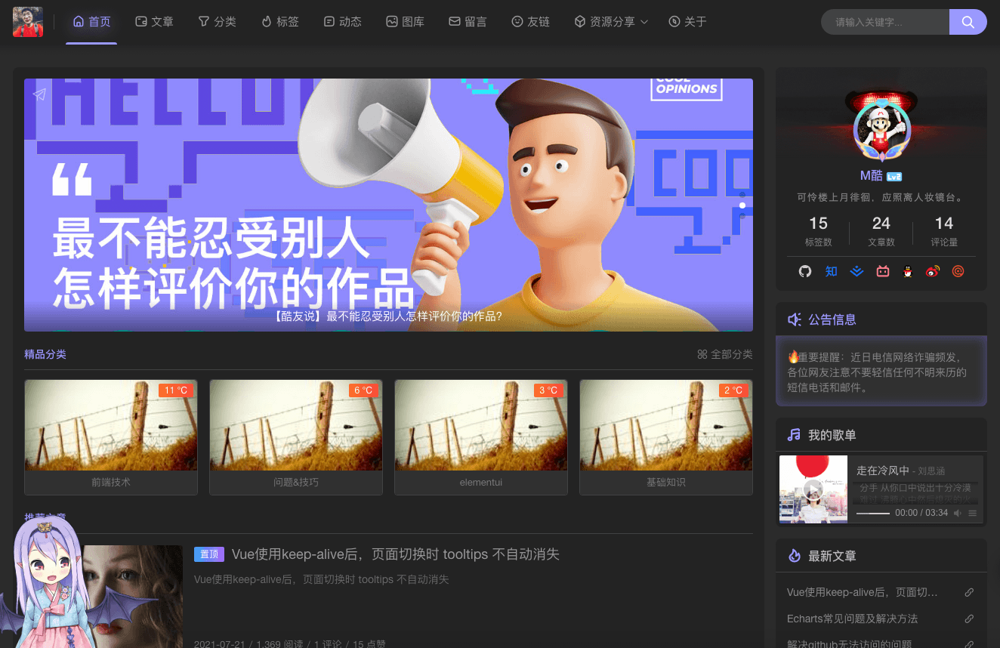

<br>

<p align="center">
  <a class="logo" href="https://github.com/qinhua/halo-theme-joe2.0">
    
  </a>
</p>

<!-- <h1 align="center" style="display:none">halo-theme-joe2.0</h1> -->

<p align="center">Joe 主题 Halo 移植版</p>

<p align="center">
  <a href="https://halo.run" target="_blank">
    
  </a>
  <a href="https://github.com/qinhua/halo-theme-joe2.0" target="_blank">
    
  </a>
  <a href="https://github.com/qinhua/halo-theme-joe2.0" target="_blank">
    
  </a>
  <a href="https://halo.run" target="_blank">
    
  </a>
</p>

> Joe2.0 为 [Typecho Themes Joe](https://github.com/HaoOuBa/Joe) 主题的 Halo 版，此次在原版主题上做了大量修改和适配，由原版的 php 模板调整为 freemarker， 移除了 Halo 上暂不支持的一些特性，也增加了一些特定的配置，保持灵活性的同时最大限度的移植了原版功能，在此感谢原作者 [Joe](https://github.com/HaoOuBa)。

<br>

<!-- ## 主题预览（目前还没移植完，敬请期待…） -->

#### [线上 Demo](https://bbchin.com)

<br>

**部分截图** 👇




<br>

## 主题安装

1. 访问 https://github.com/qinhua/halo-theme-joe2.0 获取仓库地址；

2. 进入博客后台-外观-主题-安装-在线安装，填入仓库地址进行安装，如果出错也可以选择本地安装，将下载的主题压缩包直接传上去；

3. 等待提示安装完成即可。

<br>

## 主题配置

> 此次修改对外暴露了大量的设置项，主要是为了最大程度方便用户对博客进行配置，详细设置项请参见主题根目录下的 `settings.yaml` 文件。

<!--  -->

<br>

## 主题功能

> 此次在功能上做了大量移植，在保证不破坏主题风格的情况下，加入了主流主题常见的配置项，也融入了一些自己的思考 🤔。

- 白天/黑夜模式
- 自定义主题色
- 三级导航
- 轮播图
- 留言页面
- 日志页面定制
- 文章分享
- Toc 目录
- 代码高亮 + 行号 + 复制 + 折叠
- 文章和日志页 点赞 + 评论
- 文章页 a 标签新页面打开
- 文章页复制加版权文字
<!-- - 全站 Pjax -->
- 网易歌单
- 博主可选头像框
- 博主等级展示
- 全局预载图自定义
- 缺省图片配置
- 每日一句
- 百度收录查询 + 主动推送
- 页面加载条
- 离屏提醒
- 网站公告
- 二维码模块
- 3D 标签云
- 看板娘
- 图库页面定制
- 社交账号配置
- 二维码打赏
- 广告配置
- 自定义 JS/CSS
- 自定义 favicon，支持视频
- 站点运行时间
- 整站变灰（RIP 模式）

<br>

## 改进点

- meta 标签优化
- 高亮当前 Tab
- SEO 优化
- 样式优化
  - 使用 Less 替换了 Scss
  - 降低了部分颜色的鲜艳度
- 代码风格
  - prettier
- JS 和 CSS 兼容性处理
  - JS 使用 babel 转换
  - CSS 引入 autoprefixer
  - 移除部分页面 Grid 布局
- 页面性能优化
  - 按需引入
  - DNS 预解析
- 加载状态优化
  - 加载条
- 去除无用配置
- 项目目录调整
- 部分缺陷修复
- 统一提取当前主题配置

<br>

## TODO

> 目前仍有部分功能不支持，有些是没时间做，有些是后台暂时不支持，会继续迭代的。

- 博客总访问量
- 评论组件定制化
- 评论参数简化
- 动态背景
- 首页 Splash 大屏
- 相册多种布局切换
- 递归菜单
- 多种布局切换
- 外链页面评论模块
- 自定义模板引擎
- 博客备份

## 开发指南

> 1、推荐使用 **VSCode** 开发，首先安装 **EasyLess** 插件来转换并压缩 less 文件，保存时会自动生成 `*.min.css` 文件，配置如下：

```js
"less.compile": {
    "out": "./min/",
    "outExt": ".min.css",
    "compress": true,
    "sourceMap": false,
    "autoprefixer": "> 2%, last 2 versions, not ie 6-9"
  }
```

> 2、安装 **JS & CSS Minifier** 插件来转换并压缩 js 文件，保存时会自动生成 `*.min.js` 文件，配置如下：

```js
  "es6-css-minify.js": {
    "mangle": false,
    "compress": {
      "unused": true
    },
    "output": {
      "quote_style": 0
    },
    "warnings": true
  },
  // 保存时自动生成，no为手动，可点击编辑器底部 Minify 按钮生成
  "es6-css-minify.minifyOnSave": "yes",
  "es6-css-minify.jsMinPath": "/source/js/min"
```

> 3、转换并压缩 `ES6+` 代码（前 2 步里的 js 没有经过 babel 编译，只可用于开发环境）：

- 安装 `nodejs`;
- 主题目录下执行 `npm i` 安装依赖;
- 执行 `npm run build` 即可在相应目录生成可用于生产环境的 js 文件
  <br>

## 注意点

> 主要是一些使用过程中暴露出来的问题

#### 1、如何自定义导航条图标？

- 首先通过 [iconfont](https://www.iconfont.cn/) 获取自己的图标链接，也可以用 [fontawesome](http://www.fontawesome.com.cn/) 的字体，注意要使用 font-class 类型，最后这种地址：//at.alicdn.com/t/font_2788564_1f1rnuqwnzj.css

- 通过 `管理后台-外观-主题-Joe2.0-设置-自定义`，将图标地址贴入 `字体图标链接` 中并保存；

- 通过 `管理后台-外观-菜单`，为相关菜单添加图标，也就是字体图标的类名，类似 `iconfont icon-home` 这种（字体名称+图标名称），记得保存；

- 最后，重新进入你的博客即可看到效果。

**tips: 目前主题默认采用 iconfont 字体，也可以使用其它字体服务，相信已经足够灵活了。**

#### 2、如果一个菜单有子菜单，如何禁止父菜单跳转？

- 通过 `管理后台-外观-菜单`，设置相关菜单的地址为 `#`，保存即可；

- 最后，重新进入你的博客即可看到效果。

**tips: 为了适配和展示效果，不建议添加过多菜单。**

#### 3、子菜单如何设置新页面打开？

- 通过 `管理后台-外观-菜单`，设置菜单的打开方式为 `新页面`，保存即可。

<br>

## 小建议

#### 1、建议大家为站点资源开启防盗链

- 很简单，直接在 nginx 里配一下就可以，如下配置：

```text
# 资源防盗链（指定目录or指定文件类型）
# location ~ .*\.(gif|jpg|jpeg|png|bmp|swf)$ {
location /upload/ {
  access_log off;
  # 域名白名单，去掉则阻止所有非本站请求
  alid_referers none blocked server_names *.bbchin.com 127.0.0.1 localhost ~\.google\. ~\.baidu\. ~\.qq\.;
  if ($invalid_referer) {
    rewrite ^/ https://cdn.jsdelivr.net/gh/qinhua/halo-theme-joe2.0@master/source/img/robber.jpg;
    # return 403;
  }
  proxy_pass http://127.0.0.1:8090; // 资源来源
}
```

## 页面性能报告

> 数据来自 Chrome 浏览器中的 Lighthouse
